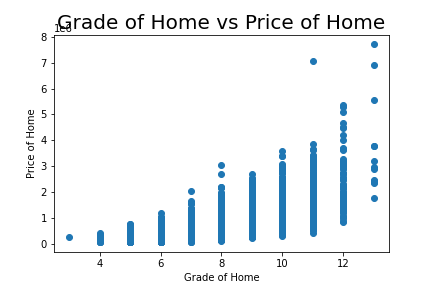

# Predicting House Prices in King County Washington

**Authors**: Daniel Blake, Andrew Calkins, Ross Richesin

## Summary

We used a linear regression model to predict house prices in King County Washington. This model allows a user to enter information about the house they are trying to sell and predicts a price based on these factors.

## Data

The dataset we used contained 21 predictors and 21000+ data points.The preliminary data cleaning included filling in missing values, translating predictors such as date of sale and zip code into a form useable for the model, and adjusting data types. After the data was cleaned a new version of the data set was created a distributed to the project members. 

## Methods

## Results
### Visual 1

Initially attempted to split data as per your representatives recommendation.
split based on grade, the strongest individual predictor of price
reevaluated after running into accuracy issues with split models
To get a baseline for our model to improve upon, we simply fed our entire cleaned dataset into a linear regression model. It showed decent correlation of around 74% .

-on the left you see some of the strongest predictors in our data, square feet living area, the King county area grading scale, number of bathrooms, and the sqft of the nearest 15 neighbors.
To improve our model we performed some standardization to make the data more uniform. In addition we also normalized the data, dropped unnecessary features, and performed some engineering for increased correlation

-The final model explain around 82% of the data’s variance or in other words, around 82% of the variability in Y( price) can be explained using X (Independent Variables).

### Visual 3

### Visual 4

### Visual 5

## Conclusions

-Splitting data resulted in model not having enough data to become properly trained, likely what caused the decreased accuracy.

-Main predictors of price are about what you’d expect, grade, sqft and the area, seen by the correlation of sqft_living15

## For More Information

Please review our full analysis in [our Jupyter Notebook](The_Notebook.ipynb) or our [presentation](project_1_powerpoint.pdf).

For any additional questions, please contact 
Daniel Blake: dablake@bsc.edu
Andrew Calkins: awcalkin@bsc.edu
Ross Richesin: rrriches@bsc.edu

## Repository Structure

├── README.md                           <- The top-level README for reviewers of this project

├── The Notebook.ipynb                  <- Narrative documentation of analysis in a Jupyter notebook

├── project 1 powerpoint.pdf            <- PDF version of project presentation

├── data                                <- Sourced externally and generated from code

└── images                              <- Code generated visualizations of data